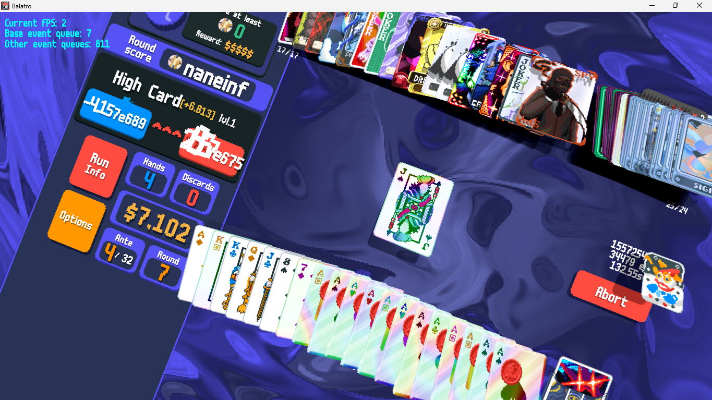

# BUSTED BUFFOONS
## What is Busted Buffoons?
Busted Buffoons is an absolutely broken mod that aims to add as many characters (That i know of) as possible.
This mod is intended to be played alongside other extremely chaotic mods like Cryptid.

## What is there to expect from the mod?
As mentioned before, this mod will feature a lot of characters from multiple media.
There are new Rarities to look out for, like Fantastic and Grandiose.
New Consumables include Infinity, Bootleg, and Pizza.
Couple new Vouchers, Enhancements, Seals, and one more edition.
There will be Meme Jokers in this, and also OC Jokers.

(Real footage of Busted Buffoons alone)

# DEPENDENCIES
For this mod to function as intended, please install all of the following dependencies:
* [Steamodded](https://github.com/Steamodded/smods) - Many Balatro Mods use this API to work.
* [Amulet](https://github.com/frostice482/Amulet) - For the Crazy Numbers.
* [Spectrallib](https://github.com/SpectralPack/Spectrallib) - For the Crazy Mechanics.

# Recommended Mods
To get the intended experience, you would have to install these mods:

### QoL Mods
These are mods for improving or changing aspects of the game.
* [Frost's Utils](https://codeberg.org/frostice482/balatro-utils) - Speed and Optimization QOL,
* [Handy](https://github.com/SleepyG11/HandyBalatro) - Allows for card swiping, faster speeds, etc.
* [Banner](https://github.com/SylviBlossom/Banner) - Lets you ban some jokers, consumables, etc.
* [DebugPlus](https://github.com/WilsontheWolf/DebugPlus) - FPS, lets you run commands using CTRL+/, useful for when you are softlocked
* [Cartomancer](https://github.com/stupxd/Cartomancer) - For hiding jokers and consumables, limiting flames, deck size, etc.
* [Overflow](https://github.com/lord-ruby/Overflow) - Stacking Negative Consumables, or just Stacking Consumables in general.
* [Engulf](https://github.com/lord-ruby/Engulf) - Editioned Planets
* [Lua Patcher](https://github.com/Piengineer12/lua_patcher) - Prevents so many crashes. (Disable if you want to hunt for any errors)

There's also [Galdur](https://github.com/Eremel/Galdur) but SMODS is already going to implement the Run Select Page System.

### Content Mods
These are mods this mod was made for.
* [Cryptid](https://github.com/SpectralPack/Cryptid) - The original blueprint for so many overpowered Balatro Mods.
* [Mayhem](https://codeberg.org/BalatroMayhem/Mayhem) - A crazy numbers mod based around joker fusions.
* [Entropy](https://github.com/lord-ruby/Entropy) - A chaotic mod inspired by The Binding of Isaac: Repentance.
* [Astronomica](https://github.com/NaoRiley/Astronomica) - A trailblazer mod that implemented "+Score" and "XScore" scoring way before SMODS did. (It is recommended you download the most recent fork of this mod.)
* [Yahimod](https://github.com/Yahiamice/yahimod-balatro) - The stupid jokes mod that inadverently gave birth to this mod.
* [900n1's Gamblepack](https://github.com/900n1/900n1Gamblepack) - A very fun and stylish mod very similar to PWX.

There is also the mod formerly known as POLTERWORX, now being referred to as BOOK OF SHADOWS, this one is technically the very inpsiration for Busted Buffoons. If you wanna download that, you would have to join their Discord Server.

# Links
Support server for Busted Buffoons.
[Busted Buffoons Bunker](https://discord.gg/P7DY5x9MNS)

Some Rarities use Custom Music, if you are streaming, you may be advised to turn off the game music.
* [NI4NI](https://www.vyletpony.com/ni4ni)
* [Thousand March](https://ronandecastel.bandcamp.com/track/thousand-march)
* [Event Horizon](https://heavenpierceher.bandcamp.com/track/event-horizon-reach-for-the-sun-and-burn-burn-burn)